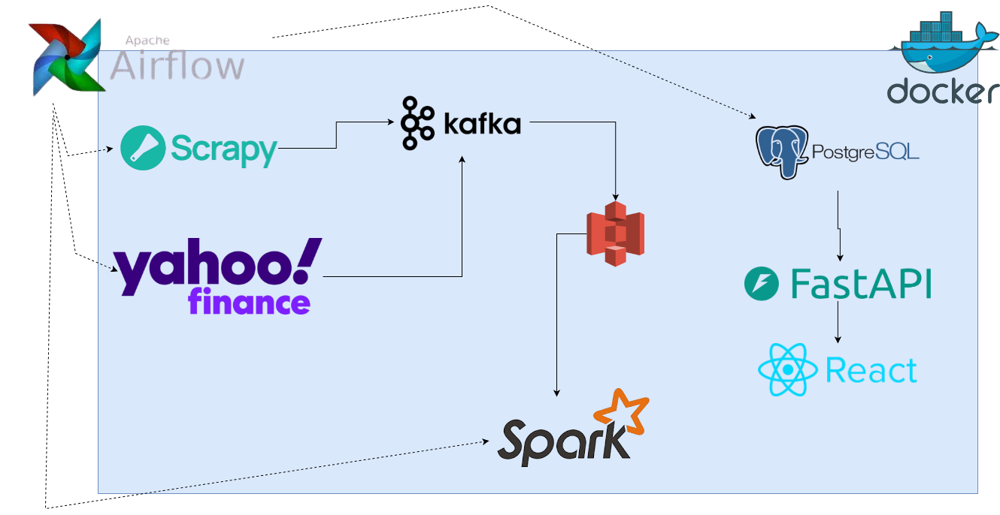

# 금빛나라 (GoldLight-Price-Pipeline)
> **실시간 뉴스 분석을 기반으로한 금 가격 관측 및 예측 데이터 플랫폼**

## 1. Project Overview
- **배경**: 환율이 올라가고 경제가 불안해저 가는 상황에서 금값은 어떻게 움직이는 관측하고자 프로젝트를 시작했습니다.
- **목적**: 실시간 뉴스와 금 시세를 결합한 데이터 파이프라인을 구축하여,시장에 따른 금값 변동과 차후 금 값이 어떻게 변할지 분석할 수 있는 환경을 제공합니다.
- **기술적 목표**: 서로 다른 주기를 가진 시계열 데이터(실시간 뉴스 및 분 단위 시세)를 정밀하게 결합하는 파이프라인 설계 최적화
- **핵심 목표**: 대용량 데이터 수집, 분산 처리, 워크플로우 자동화를 통한 데이터 엔지니어링 엔드 투 엔드 경험 확보.

## 2. Architecture Diagram

*Docker 컨테이너 환경에서 Airflow를 지휘자로 한 분산 데이터 파이프라인 구조*

## 3. Key Features
- **Data Ingestion**: `Scrapy`를 활용한 뉴스 비동기 수집 및 `yFinance` API를 통한 시세 수집.
- **Message Bus**: `Apache Kafka`를 도입하여 수집과 처리 레이어 간의 결합도 해제.
- **Data Lake**: `AWS S3`에 Raw Data와 정제 데이터를 구분하여 저장.
- **Data Processing**: `Apache Spark`를 이용해 뉴스 분석 및 시세 데이터 결합 연산.
- **Orchestration**: `Apache Airflow`를 통해 수집-저장-처리 전 과정을 자동화 및 모니터링.

## 4. Tech Stack
| 구분 | 기술 스택 | 비고 |
| :--- | :--- | :--- |
| **Language** | Python 3.9 | - |
| **Ingestion** | Scrapy (News), yfinance (Price) ,Kafka | Real-time Streaming |
| **Processing** | PySpark, Spark Streaming | Batch & Stream Processing |
| **Storage** | AWS S3, PostgreSQL | Data Lake & Warehouse |
| **Ops/Infra** | Docker, Airflow, Terraform, AWS EC2 | IaC & Containerization |

## 5. Getting Started
```bash
# 아직 개발 진행 중인 프로젝트입니다.
```

## 최종 배포 환경: AWS EC2 (Docker-compose 기반)